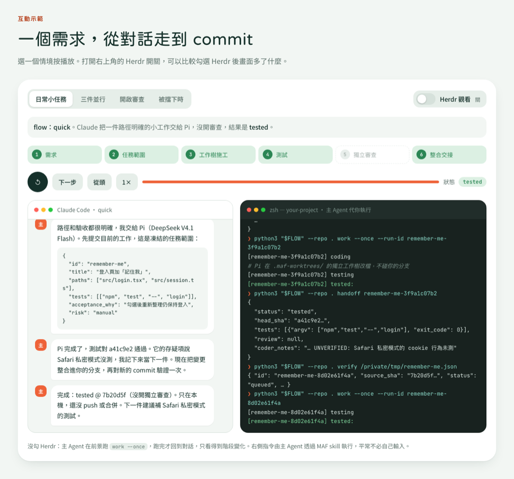

# multiple-agents-flow

**留在你習慣的 Claude Code 或 Codex 對話，把明確的小工作交給別的 agent，完成要有 commit 綁定的測試證據。**

> **送給喜歡在 terminal 工作的你。** MAF 就在 Claude Code、Codex 的 terminal 對話裡運作：不用另開 app、網頁面板或常駐服務。想同時看好幾個 agent 做事，搭配 [Herdr](https://ian902792.github.io/multiple-agents-flow/#herdr) 這類 terminal 多工器就好。

### ▶ [先看 3 分鐘動畫導覽](https://ian902792.github.io/multiple-agents-flow/)

一步步播放五個情境：日常委派、三件並行、一晚跑一批、開啟審查、被擋下時；也能切換 Herdr 觀看模式比較差異。

[](https://ian902792.github.io/multiple-agents-flow/)

## 它做什麼

- **你照常在 terminal 聊天**：在 Claude Code 或 Codex 描述需求。範圍清楚的小工作，主 Agent 會交給 Pi、Antigravity 或 Codex 在獨立工作樹完成。
- **證據綁定 commit**：測試由 MAF 自己跑，結果綁定精確的 commit SHA；需要時再請另一家模型審查同一個 commit。
- **只用現有訂閱**：不會改用 API 計費；額度或登入狀態不明就停下。

## 快速開始

需要 macOS 或 Linux、Python 3.11+、Git，以及 Claude Code 或 Codex。

**1. 安裝一次**

```sh
git clone https://github.com/ian902792/multiple-agents-flow.git
cd multiple-agents-flow
python3 flow.py install-skills
```

裝完重開主對話。想換預設 flow，執行 `python3 flow.py ui` 開啟 Flow Studio。

**2. 確認只用訂閱**：先到各家控制台確認額外付費用量、OpenCode Go 的 Use balance 都已關閉，再記錄一次：

```sh
python3 flow.py confirm-billing --no-overage                # Claude 預設
python3 flow.py --main codex confirm-billing --no-overage   # Codex 預設
```

換模型或工具時才需要再確認；調整推理強度不用。

**3. 在任何已有 commit 的 Git 專案直接說**：

> maf：完成這項修改。明確的小工作可以委派；完成後測試已提交的變更，告訴我結果與 commit SHA。

## 日常怎麼說

指揮 MAF 時以 **maf** 開頭，避免 agent 把 flow、mode 等常見字誤會成別的東西。

| 想做的事 | 對主 Agent 說 |
| --- | --- |
| 換分工方式 | 「maf 改用 quick」、「maf 改回全域預設」 |
| 同時處理幾件獨立的小事（任何 flow 都可以，Pi、Antigravity 或 Codex 最多並行 3 件） | 「maf 同時處理 1. … 2. … 3. …，各自驗收」 |
| 看進度 | `/maf status`（Codex 用 `$maf status`） |
| 大任務先請另一家的強模型規畫 | `/maf-plan 需求`（Codex 用 `$maf-plan 需求`） |
| 做完直接發布 | 「全部驗證通過後直接開 PR 並合併」 |

MAF 預設只做到本機驗證；push、PR、合併要你說一次，一次就能涵蓋整批任務。

## 一晚跑一批任務

你只要說三句話：

1. `/maf-plan 訂單功能：資料模型、API、頁面、文件，今晚做完`：另一家的強模型（Claude 主對話時是 Astra）只讀規畫完整計畫。
2. 回答主 Agent 問你的問題，說「確認，開始吧」：主對話先做核心並 commit，MAF 試跑驗收測試（不花 token），小任務 Agent 一件接一件做。
3. 起床說「maf 報告」：看中文報告，整合完成的部分，做你的實際使用測試。

只要還有問題沒決定，整份計畫就不會執行。先跑 `python3 examples/overnight/demo.py` 看模擬（幾秒、不花額度），詳見[一晚跑一批任務](docs/OVERNIGHT.md)。

## 內建 flow

| Flow | 主對話 | 小任務交給 | 規畫（手動 maf-plan） |
| --- | --- | --- | --- |
| `quick`（Claude 預設） | Claude Opus 5.5 | Pi · DeepSeek V4.1 Flash | Codex GPT-6 Astra |
| `quick-antigravity` | Claude Opus 5.5 | Antigravity · Gemini 3.8 Flash Low | Codex GPT-6 Astra |
| `quick-codex` | Claude Opus 5.5 | Codex · GPT-6 Luna（推理 `none`） | Codex GPT-6 Astra |
| `planned` | Claude Opus 5.5 | Pi · DeepSeek V4.1 Flash | Codex GPT-6 Astra，大任務先規畫 |
| `codex-pi`（Codex 預設） | Codex GPT-6 Sol | Pi · DeepSeek V4.1 Flash | Claude Opus 5.5 |

獨立審查預設關閉，可在 Flow Studio 開啟；審查者與規畫者一定和主對話不同家。Pi 與 Antigravity coder 預設推理強度都是 `low`，依據見[基準測試](bench/effort/README.md)。

## 為什麼選 MAF

- **不相信 agent 自己的說法**：完成與否看 MAF 自己跑的測試，commit 一變，舊證據就作廢。
- **由程式把關**：可修改的檔案在排入時就鎖定，越界就停；中斷後可以恢復，不會盲目重跑。
- **省主對話額度**：寫程式的工作交給別家訂閱，主對話只花在判斷與整合。
- **換一家看**：規畫與審查由不同家的模型負責，避免同一種盲點。
- **terminal 原生**：指令、進度、交接都在 terminal；Flow Studio 網頁只是選用的設定畫面。

和同一家的子 agent、其他多 agent 做法的比較，以及相對的限制，請看[導覽頁的特色一節](https://ian902792.github.io/multiple-agents-flow/#why)。

## 延伸閱讀

- [一晚跑一批任務](docs/OVERNIGHT.md)：規畫、決定、夜間執行、早上報告。
- [讓主對話自動使用 MAF](docs/AGENT-INSTRUCTIONS.md)：六行提示詞，含自己的 repo 自動合併的選用設定。
- [指令參考](docs/CLI.md)：CLI、任務 JSON、核准與中斷恢復、Herdr 觀看模式。
- [Pi 推理強度基準測試](bench/effort/README.md)：用固定題目自己比較 `off`～`max`。
- [版本紀錄](CHANGELOG.md)：目前版本可用 `python3 flow.py --version` 查看。
- [新增 agent adapter](docs/ADAPTERS.md)、[參與貢獻](CONTRIBUTING.md)、[實作契約](docs/IMPLEMENTATION.md)、[驗證紀錄](docs/VALIDATION.md)。

只在你信任的 repository 使用：工作樹不是安全沙箱，測試會執行你核准的命令。

MIT 授權。開發者測試：`python3 -m unittest discover -s tests -v`。
