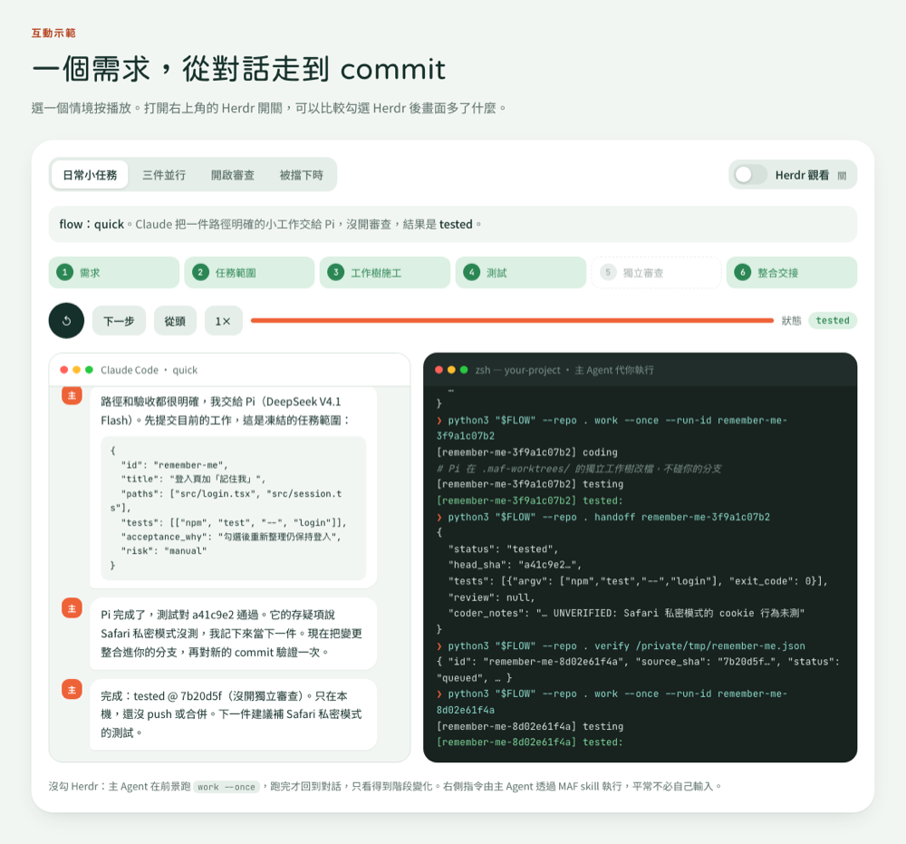

# multiple-agents-flow

**留在你習慣的 Claude Code 或 Codex 對話，把明確的小工作交給別的 agent，完成要有 commit 綁定的測試證據。**

### ▶ [先看 3 分鐘動畫導覽](https://ian902792.github.io/multiple-agents-flow/)

第一個情境是簡單版：你只說需求，主 Agent 自己分流；其他情境示範手動指揮、三件並行、一晚跑一批、開啟審查、被擋下時。

[](https://ian902792.github.io/multiple-agents-flow/)

## 三步開始

需要 macOS 或 Linux、Python 3.11+、Git，以及 Claude Code 或 Codex。

**1. 安裝**

```sh
git clone https://github.com/ian902792/multiple-agents-flow.git
cd multiple-agents-flow
python3 flow.py install-skills
```

**2. 選 flow，確認只用訂閱**：先到各家控制台確認額外付費用量、OpenCode Go 的 Use balance 都已關閉。

```sh
python3 flow.py settings default-flow quick-flash   # 選用；不設就是 quick，怎麼選見下方「選 flow」
python3 flow.py confirm-billing --no-overage                # Claude 主對話
python3 flow.py --main codex confirm-billing --no-overage   # Codex 主對話（它的預設 flow 是 codex-pi）
```

**3. 讓主對話自動分流**：把[六行提示詞](docs/AGENT-INSTRUCTIONS.md#可直接複製的提示詞)貼進 `~/.claude/CLAUDE.md`（Codex 是 `~/.codex/AGENTS.md`），重開主對話。

## 簡單版：照常說需求

在任何已有 commit 的 Git 專案，像平常一樣說「幫我加訂單 CSV 匯出，要有測試」。不用記指令，主 Agent 依第一個符合的情況分流：

| 任務 | 主 Agent 怎麼做 |
| --- | --- |
| 碰到認證、金流、資料、權限、部署 | 先問你，自己做並開審查 |
| 需求模糊、要做好幾個決定、跨模組或超過約 5 個檔案 | 建議你先跑 `/maf-plan` |
| 一次短回合做得完，或得先探索才知道改哪裡 | 自己改 |
| 路徑明確、有測試能驗收 | 交給小任務 Agent，多件一起送出 |

完成時它會給你 commit SHA 與 MAF 跑出的測試證據。委派失敗到修復次數用完，它會換做法或自己接手，不原樣重試，因為重試比 token 單價更貴。小改動、非 Git 資料夾、沒有能驗收的測試時看不到委派，是正常的。push、PR、合併要你說一次。

## 手動版：以 maf 開頭指揮

想自己決定時，話的開頭加 **maf**，避免 agent 把 flow、mode 等常見字誤會成別的東西。

| 想做的事 | 對主 Agent 說 |
| --- | --- |
| 指定要委派 | 「maf 把 CSV 匯出交出去，做完告訴我 commit SHA」 |
| 同時處理幾件獨立的小事（最多並行 3 件） | 「maf 同時處理 1. … 2. … 3. …，各自驗收」 |
| 換分工方式 | 「maf 改用 quick-flash」、「maf 改回全域預設」 |
| 看進度 | `/maf status`（Codex 用 `$maf status`） |
| 大任務先請另一家的強模型規畫 | `/maf-plan 需求`（Codex 用 `$maf-plan 需求`） |
| 做完直接發布 | 「全部驗證通過後直接開 PR 並合併」 |

**一晚跑一批**：`/maf-plan 訂單功能：資料模型、API、頁面、文件，今晚做完` → 回答它的問題、說「確認，開始吧」→ 起床說「maf 報告」。問題沒決定完，計畫就不會執行。先跑 `python3 examples/overnight/demo.py` 看模擬（不花額度），詳見[一晚跑一批任務](docs/OVERNIGHT.md)。

## 選 flow

| Flow | 主對話 | 小任務交給 | 規畫（手動 maf-plan） |
| --- | --- | --- | --- |
| `quick`（Claude 預設） | Claude Opus 5.5 | Pi · DeepSeek V4.1 Flash | Codex GPT-6 Astra |
| `quick-flash` | Claude Opus 5.5 | Pi · DeepSeek V4.1 Flash，審查也交 Pi（預設開啟） | Codex GPT-6 Astra |
| `quick-antigravity` | Claude Opus 5.5 | Antigravity · Gemini 3.8 Flash Low | Codex GPT-6 Astra |
| `quick-codex` | Claude Opus 5.5 | Codex · GPT-6 Luna（推理 `none`） | Codex GPT-6 Astra |
| `planned` | Claude Opus 5.5 | Pi · DeepSeek V4.1 Flash | Codex GPT-6 Astra，大任務先規畫 |
| `codex-pi`（Codex 預設） | Codex GPT-6 Sol | Pi · DeepSeek V4.1 Flash | Claude Opus 5.5 |

Opus 額度少、Pi 額度多就選 `quick-flash`，理由見[誰實作、誰審查](docs/ROLES.md)。其他 flow 的獨立審查預設關閉，可在 Flow Studio（`python3 flow.py ui`）開啟；審查者與規畫者一定和主對話不同家。推理強度預設 `low`，依據見[基準測試](bench/effort/README.md)。

## 為什麼選 MAF

- **不相信 agent 自己的說法**：完成與否看 MAF 自己跑的測試，commit 一變，舊證據就作廢。
- **由程式把關**：可修改的檔案在排入時就鎖定，越界就停；修復有次數上限，中斷後可以恢復，不會盲目重跑。
- **省主對話額度**：寫程式的工作交給別家訂閱，主對話只花在判斷與整合；只用現有訂閱，不改用 API 計費。
- **換一家看**：規畫與審查由不同家的模型負責，避免同一種盲點，也較不容易被 repo 裡同一段 prompt injection 同時騙過。這是降低風險而非保證，工作樹也不是安全沙箱。
- **terminal 原生**：指令、進度、交接都在 Claude Code、Codex 的對話裡；想同時看好幾個 agent，搭配 [Herdr](https://ian902792.github.io/multiple-agents-flow/#herdr)。

和同一家的子 agent、其他多 agent 做法的比較，以及相對的限制，請看[導覽頁的特色一節](https://ian902792.github.io/multiple-agents-flow/#why)。

## 延伸閱讀

- [一晚跑一批任務](docs/OVERNIGHT.md)：規畫、決定、夜間執行、早上報告。
- [讓主對話自動使用 MAF](docs/AGENT-INSTRUCTIONS.md)：六行提示詞，含自己的 repo 自動合併的選用設定。
- [誰實作、誰審查](docs/ROLES.md)：強弱模型怎麼分工才省又好，以及審查迴圈為什麼會失控。
- [指令參考](docs/CLI.md)：CLI、任務 JSON、核准與中斷恢復、Herdr 觀看模式。
- [Pi 推理強度基準測試](bench/effort/README.md)：用固定題目自己比較 `off`～`max`。
- [版本紀錄](CHANGELOG.md)：目前版本可用 `python3 flow.py --version` 查看。
- [新增 agent adapter](docs/ADAPTERS.md)、[參與貢獻](CONTRIBUTING.md)、[實作契約](docs/IMPLEMENTATION.md)、[驗證紀錄](docs/VALIDATION.md)。

只在你信任的 repository 使用：工作樹不是安全沙箱，測試會執行你核准的命令。

MIT 授權。開發者測試：`python3 -m unittest discover -s tests -v`。
